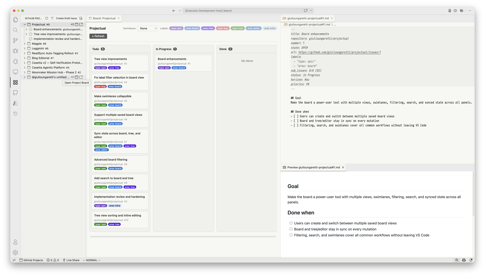

# Projectual — GitHub Projects in VS Code

Kanban boards, swimlanes, issue editing, and dashboards for GitHub Projects v2 — without leaving VS Code.



## Features

- **Kanban Board** — Drag-and-drop status changes, label filter chips, swimlanes by label/assignee/custom fields
- **TreeView Sidebar** — Browse projects with nested sub-issues, pin/focus a single project, group by status or flat list
- **Issue Editor** — Open issues as editable markdown with YAML frontmatter, inline preview, and CodeLens actions
- **Quick Actions** — Change status, assignees, labels, and custom fields from context menus and command palette
- **Create Issues & Drafts** — Create new issues or draft issues without leaving VS Code
- **Sub-issue Hierarchy** — Parent/child nesting with progress indicators (`[2/5]`)

## Getting Started

1. Install the extension
2. Click the **Projectual** icon in the Activity Bar (sidebar)
3. Sign in to GitHub when prompted (uses VS Code's built-in GitHub auth)
4. Your projects appear in the sidebar — click the board icon to open a Kanban view

## Commands

| Command | Description |
|---------|-------------|
| `GitHub Projects: Sign In to GitHub` | Authenticate with GitHub |
| `GitHub Projects: Refresh` | Refresh all project data |
| `GitHub Projects: Open Project Board` | Open a Kanban board for a project |
| `GitHub Projects: Focus Project` | Pin the tree to a single project |
| `GitHub Projects: Group by Status` | Toggle status grouping in tree |
| `GitHub Projects: Create Issue` | Create a new issue and add to a project |
| `GitHub Projects: Create Draft Issue` | Create a draft issue in a project |
| `GitHub Projects: Change Status` | Change an item's status |
| `GitHub Projects: Change Assignees` | Modify issue assignees |
| `GitHub Projects: Change Labels` | Modify issue labels |
| `GitHub Projects: Edit Issue` | Open issue as editable markdown |
| `GitHub Projects: Open in GitHub` | Open item in browser |

## Required GitHub Permissions

The extension requests these OAuth scopes:

- `project` — Read and write GitHub Projects v2
- `repo` — Access issue details, labels, assignees

## Development

```bash
# Install dependencies
npm install

# Compile (with sourcemaps)
npm run compile

# Watch mode
npm run watch

# Build (minified)
npm run build

# Type check
npm run lint

# Package as .vsix
npm run package
```

### Running in VS Code

1. Open this folder in VS Code
2. Press `F5` to launch the Extension Development Host
3. The extension will activate in the new window

## Architecture

```
src/
├── extension.ts              # Entry point, wiring
├── auth/github-auth.ts       # GitHub OAuth via VS Code auth API
├── api/
│   ├── graphql-client.ts     # Authenticated GraphQL client
│   ├── queries.ts            # GraphQL queries
│   ├── mutations.ts          # GraphQL mutations
│   └── types.ts              # TypeScript interfaces
├── tree/
│   ├── project-tree-provider.ts  # TreeView data provider
│   ├── tree-items.ts         # TreeItem rendering
│   └── tree-types.ts         # Tree node types
├── webview/
│   ├── board-panel.ts        # Kanban board WebviewPanel
│   ├── issue-document-provider.ts  # Issue-as-markdown FileSystemProvider
│   └── webview-utils.ts      # HTML, CSP, messaging helpers
├── providers/
│   ├── issue-codelens-provider.ts  # CodeLens for issue actions
│   ├── issue-decoration-provider.ts
│   ├── issue-diagnostic-provider.ts
│   └── issue-folding-provider.ts
├── commands/
│   ├── project-commands.ts   # Project-level commands
│   ├── issue-commands.ts     # Issue CRUD commands
│   └── field-commands.ts     # Field editing commands
└── models/
    └── project-model.ts      # Data cache with optimistic updates
```

## License

MIT
